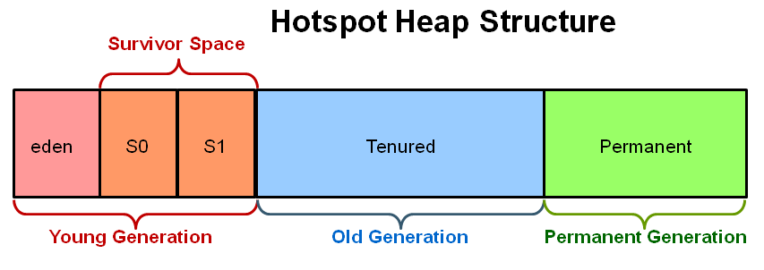

# Swift
https://docs.swift.org/swift-book/ReferenceManual/Declarations.html#ID545
https://jusung.gitbook.io/the-swift-language-guide/language-guide/07-closures
## 1.언어 특징


<details>
<summary style="font-size:x-large;font-weight:bold"> 1.1 정적언어</summary>
<div markdown="1" style="font-size:large;">

- ##### 컴파일 단계에서 변수 및 상수의 형 정보를 결정
- ##### 런타임 오작동 안정성 보장
</div>
</details>


<details>
<summary style="font-size:x-large;font-weight:bold"> 1.2 nil</summary>
<div markdown="1" style="font-size:large;">

- ##### Objective-C 에서는 포인터를 지원하기 때문에 다음의 4가지를 사용. (Swift에서는 <span style="color:red">nil</span>만 사용!)
|nil|Nil|NULL|NSNull|
|---|---|---|---|
|Object의 부재|Class의 부재|C-Pointer의 부재|NSObject를 상속받는 객체로 collection item을 null로 설정할 필요가 있을때 사용|
|```NSString *temp = nil;```|```Class temp = Nil```|```int *temp = NULL;```|```[temp addObject:[NSNull null]];```<br/>``` if ([temp objectAtIndex:0] == [NSNull null])```|
</div>
</details>


<details>
<summary style="font-size:x-large;font-weight:bold"> 1.3 타입추론</summary>
<div markdown="1" style="font-size:large;">

```
// 변수
var a = 1;
// 상수
let b = 2;
```

- ##### 컴파일 시점에서 변수의 타입을 지정
```
let a = 1234 // int 
let b = "test" //String
```
- ##### 하지만 아래와같이 사용하면 컴파일 시 어떤타입으로 지정할지 알 수 없음. 컴파일러가 점쟁이는 아니므로 값을 할당하지 않을거면
```
let c
```
- ##### 아래와 같이 타입을 지정(어노테이션)!
```
let c : String
```
</div>
</details>


<details>
<summary style="font-size:x-large;font-weight:bold"> 1.4 Objective-C 연동</summary>
<div markdown="1" style="font-size:large;">

- ##### Swift에서 Objective Function을 사용할 수도 있고, Objective-C에서 Swift Function을 사용할 수 있다.
- ##### 단 Swift4 이상에서는 함수앞에 @objc Inference(추론)을 사용하여 사용하여야 한다.
```
@objc func mySwiftFn() {
    print("funking swift")
}
```
</div>
</details>

<details>
<summary style="font-size:x-large;font-weight:bold"> 1.5 함수가 1급 객체</summary>
<div markdown="1" style="font-size:large;">

- ##### 변수에 할당 가능
- ##### 파라미터로 전달 가능
- ##### 함수를 리턴가능

</div>
</details>


## 2.기초 문법

<details>
<summary style="font-size:x-large;font-weight:bold"> 2.1 제어문</summary>
<div markdown="1" style="font-size:large;">

- ##### while Loop
```
var i = 0
while i < 10 {
    print(i)
    if i == 5 {
        break
    }
    i += 1
}
```
- ##### for Loop
```
// 1부터 10까지
for i in 1...10{ 
    print(i) 
}
// 0부터 9까지
for i in 0..<10{ 
    print(i) 
}
// where 조건을 만족하면 실행
for i in 1...10 where i % 2 == 0 { 
    print(i) 
}
// 10부터 1까지 반대로
for i in stride(from: 10 , to: 1, by: -1) {
   print(i)
}
```
- ##### switch Loop
```
let num = 10

switch num {
case 0:
    print("--> 0 입니다")
case 5...8:
    print("--> 5 ~ 8사이 입니다")
case 10:
    print("--> 10 입니다")
default :
    print("--> 나머지 입니다")
}
```
</div>
</details>


<details>
<summary style="font-size:x-large;font-weight:bold"> 2.2 Swift 자료형 Tuple</summary>
<div markdown="1" style="font-size:large;">

- ##### 다양한 데이터들의 묶음 (여러 Type의 값을 하나로 묶어 사용)
```
var tuple = (1, "Hello, world!", true)
tuple.0 //1
tuple.1 //"Hello, world!"
tuple.2 //true

// 아래 처럼 파라메터에 이름 지정 가능!
var person = (name: "션", age: 15, isJammin: true)
```
</div>
</details>


<details>
<summary style="font-size:x-large;font-weight:bold"> 2.3 함수</summary>
<div markdown="1" style="font-size:large;">

##### 표현식
- ###### Void (Return Type 생략가능)
```
func nothingReturn(person: String) {
    print("Hello, \(person)!")
}
// 호출
nothingReturn(person: "lee")
```

- ###### Return Type 지정

```
func stringReturn(person: String) -> String {
    return "test"
}
// 호출
print(nothingReturn(person: "lee"))
```

###### 위 함수 예제를 보면 함수를 호출할 때에 파라미터명을 입력을 해주는 것을 볼 수 있다. 이걸 <span style="color:red">Argument Label</span> 이라 하는데 아규먼트 레이블을 바꾸고 싶다면 파라미터명 앞에 입력해서 사용
```
func argLabelTest(from person: String){
    print(person)
}
// 호출
argLabelTest(from: "lee")
```

###### 함수 호출 시 <span style="color:red">Argument Label을 생략</span>하고 사용하려면 Argument Label 자리에 <span style="color:red;font-weight:bold;font-size:x-large">_</span>(언더바, underscore)를 붙여주면 호출시 생략 가능하다.
```
func nonArgLabelTest(_ person: String){
    print(person)
}
// 호출
nonArgLabelTest("lee")
```


파라미터는 기본적으로 상수, 변수로 쓰려면 파라미터 type 앞에 <span style="color:violet;font-weight:bold;">inout</span> 예약어 사용하여 함수 선언하고 호출 시 파라미터 변수 앞에 <span style="color:violet;font-weight:bold;">&</span>(ampersand) 사용
```
func toggle(value : inout Bool){
    value = !value
}
// 호출
var isStupid = false
toggle(value: &isStupid)
```

</div>
</details>


<details>
<summary style="font-size:x-large;font-weight:bold"> 2.4 Closure</summary>
<div markdown="1" style="font-size:large;">

- ##### 정의
```
“A closure is the combination of a function and the lexical environment within which that function was declared.”
클로저는 함수와 그 함수가 선언됐을 때의 렉시컬 환경(Lexical environment)과의 조합이다.
-> 클로저는 반환된 내부함수가 자신이 선언됐을 때의 환경(Lexical environment)인 스코프를 기억하여 자신이 선언됐을 때의 환경(스코프) 밖에서 호출되어도 그 환경(스코프)에 접근할 수 있는 함수
- MDN -

클로저는 어떤 상수나 변수의 참조를 캡쳐(capture)해 저장
- Swift -

일급 객체 함수의 처리를 위해 사용

// EX
func makeIncrementer(forIncrement amount: Int) -> () -> Int {
    var runningTotal = 0
    func incrementer() -> Int {
        runningTotal += amount
        return runningTotal
    }
    return incrementer
}

let incrementByTen = makeIncrementer(forIncrement: 10)
incrementByTen()
// returns a value of 10
incrementByTen()
// returns a value of 20
incrementByTen()
// returns a value of 30

let incrementBySeven = makeIncrementer(forIncrement: 7)
incrementBySeven()
// returns a value of 7
```

- ##### 종류
|Named Closure(우리가 알고있는 함수)|Unnamed Closure|
|---|---|
|```func doSomething() {print("Somaker")}```|```let closure = { print("Somaker") }```|

##### Unnamed Closure에 대해서 알아봅시다
- ##### 표현식
```
{
    (Parameters) -> Return Type in
     실행 구문
}
```
```
 (Parameters) -> Return Type  // 클로저헤드
 in 실행 구문 // 클로저 바디

```
```
// Return X, Parameters X
{ () -> () in
    print("Closure")
}
// Return O, Parameters O
{ (name: String) -> String in
    return "Hello, \(name)"
}
```
- ##### Unnamed Closure에는 아규먼트 라벨(Argument Label) 사용X
```
let unnamedTest = { (name: String) -> String in
    return "Hello, \(name)"
}
unnamedTest("lee")
```

</div>
</details>


<details>
<summary style="font-size:x-large;font-weight:bold"> 2.5 옵셔널</summary>
<div markdown="1" style="font-size:large;">

- ##### 값이 nil 일 수도 있는 변수
```
let name: String? = nil 
```

- ##### 옵셔널 값 사용법
1. 강제 언래핑 (Forced unwrapping)
```
let name: String?
name = "lee"
print(name!)
```
2. Optional binding (if let)
```
if let unwrappedName = name{
    print(unwrappedName)
}else{
    print("nil!")
}

// else 생략 가능
if let unwrappedName = name{
    print(unwrappedName)
}
```
3. Optional binding (guard)
```
func guardTest(name : String?) {
    guard let unwrapperedName = name else {
        print("nil!")
        return
    }
    print(unwrapperedName)
}
```
4. Nil coalescing
```
var name : String?
name = "lee"
let unwrapperedName = name ?? "kim"
```


</div>
</details>

<details>
<summary style="font-size:x-large;font-weight:bold"> 2.6 컬렉션</summary>
<div markdown="1" style="font-size:large;">

||Array|Dictionary|Set|
|--|--|--|--|
|특징|배열|K-V|중복X배열형태|
|순서|O|X|X|
|코드|```let arr1: Array<Int>```<br/>```let arr1: [Int]```<br/>```let arr1 = [1, 2, 3, 4, 5]```|```var cityCode: [String : String] = ["051": "Butsan", "02": "Soul"]```|```var someSet: Set<Int> = [1, 2, 3, 1]```|


</div>
</details>


<details>
<summary style="font-size:x-large;font-weight:bold"> 2.7 구조체 vs 클래스</summary>
<div markdown="1" style="font-size:large;">


<table>
    <tr>
        <th>구조체 struct</th>
        <th>클래스 class</th>
    </tr>
    <tr>
        <td colspan="2">함수/프로퍼티 정의 가능</td>
    </tr>
    <tr>
        <td>Value Types</td>
        <td>Reference Types</td>
    </tr>
    <tr>
        <td>STACK</td>
        <td>HEAP</td>
    </tr>
    <tr>
        <td>기본 깊은복사</td>
        <td>기본 얕은복사</td>
    </tr>
</table>

</div>
</details>

<details>
<summary style="font-size:x-large;font-weight:bold"> 2.8 프로퍼티</summary>
<div markdown="1" style="font-size:large;">

##### Stored Property- 객체가 담고있는 데이터
##### Computed Property - 어떠한 값을 직접 저장하지는 않고 저장된 정보를 이용해서 가공 혹은 계산된 값을 사용할때
##### Type property - 생성된 인스턴스에 상관없이 그 스트럭트의 타입자체의 속성을 정하고 싶을때 사용

```
struct Person {
    private(set) var _age:Int = 1
    var age:Int {
          get {
             return _age
          }
          set (newVal) {
             if (newVal < 1){
                print("impossible")
             }else if(newVal < _age){
                print("can't go against time")
             }else{
                 _age = newVal
             }
          }
       }
    
    var height: Int{
       didSet(oldVal){
          // 변경된 직후에 호출
       }
       willSet(newVal){
          // 직전에 호출
       }
    }
    
    var weight: Int{
       didSet(oldVal){
          // 변경된 직후에 호출
       }
       willSet(newVal){
          // 직전에 호출
       }
    }
    
    // Computed Property
    var bmi : Int{
        get {
            return height * weight
        }
    }
}

```


</div>
</details>
 


## 3.ARC (Automatic Reference Counting)

 
<details>
<summary style="font-size:x-large;font-weight:bold"> 3.1 ARC란?</summary>
<div markdown="1" style="font-size:large;">

- ##### Reference의 숫자를 자동으로 세는 메모리 관리자
- ##### Reference를 저장하는 객체(Heap에 저장되는 객체)만 ARC의 영향
- ##### Strong Reference Count가 0이된 것을 ARC가 메모리에서 해제
    - weak   : 객체를 참조는 하지만, Reference count 를 증가시키지 않는다.
    - strong : 객체를 참조하며, Reference count 를 증가시킨다.
</div>


</details>

<details>
<summary style="font-size:x-large;font-weight:bold"> 3.2 ARC 작동원리</summary>
<div markdown="1" style="font-size:large;">

- ##### 클래스의 새로운 인스턴스를 생성할 때 마다 ARC는 인스턴스의 정보를 저장하기 위해서 메모리를 할당
- ##### 메모리에는 해당 인스턴스와 연결된 모든 저장 프로퍼티의 값과 함께 인스턴스의 타입에 대한 정보가 저장
- ##### 인스턴스가 필요 없어질 때, ARC 는 메모리를 다른 목적으로 사용될 수 있게 하기 위해 그 인스턴스가 사용하는 메모리를 해제


</div>
</details>


<details>
<summary style="font-size:x-large;font-weight:bold"> 3.3 ARC vs GC</summary>
<div markdown="1" style="font-size:large;">

||ARC|GC|
|--|--|--|
|시점|Compile|Runtime|
|장점|런타임 시 메모리 관리를 위한 시스템 자원이 불필요|상호 참조 상황등의 복잡한 상황에서도 인스턴스를 해제할 수 있는 가능성이 더 높으며 메모리 해제를 신경 안써줘도 돼서 개발이 편해진다|
|단점|ARC의 작동 규칙을 모르고 사용하면 메모리릭 발생 가능|프로그램 동작 외의 메모리 감시를 위한 추가 자원이 필요하며 인스턴스가 언제 할당이 해제되는지 예측하기 어렵다|



</div>
</details>


<details>
<summary style="font-size:x-large;font-weight:bold"> 3.4 강한참조 순환 문제</summary>
<div markdown="1" style="font-size:large;">

##### 예제 클래스
```
class Person {
    init(name:String) {
        self.name = name
    }
    var name: String
    var child: Person? = nil
}
```

##### 아래의 코드를 언뜻 보면 두 객체는 모두 메모리에서 해제가 될것처럼 보인다.
```
var p1: Person? = Person(name: "사담 문제인")
var p2: Person? = Person(name: "문준옹")

p1?.family = p2
p2?.family = p1

p1 = nil
p2 = nil
```


##### 하지만 참조 카운트를 계산해보면 마지막에 참조 카운터가 아직 1 남아있어서 메모리에서 소거되지 않았음을 예측할 수 있다
```
// p1 참조 카운트 = 1
var p1: Person? = Person(name: "사담 문제인")
// p2 참조 카운트 = 1
var p2: Person? = Person(name: "문준옹")

// p2 참조 카운트 = 2
p1?.family = p2
// p2 참조 카운트 = 2
p2?.family = p1

// p1 참조 카운트 = 1
p1 = nil
// p2 참조 카운트 = 1
p2 = nil
```

##### 이러한 강한참조를 해결하려면 <span style="color:purple;font-size:large;font-weight:bold">weak</span>예약어를 사용하여 해당 프로퍼티에 참조카운트를 증가시키지 않는 방법이 있다.

```
class Person {
    init(name:String) {
        self.name = name
    }
    var name: String
    weak var child: Person? = nil
}
```
```
// p1 참조 카운트 = 1
var p1: Person? = Person(name: "사담 문제인")
// p2 참조 카운트 = 1
var p2: Person? = Person(name: "문준옹")

// p2 참조 카운트 = 1
p1?.family = p2
// p2 참조 카운트 = 1
p2?.family = p1

// p1 참조 카운트 = 0
p1 = nil
// p2 참조 카운트 = 0
p2 = nil
```
</div>
</details>


<br/>
<details>
<summary style="font-size:xx-large;font-weight:bold">마치며</summary>
<div markdown="1" style="font-size:large;">

# 갓러터 합시다!

</div>
</details>