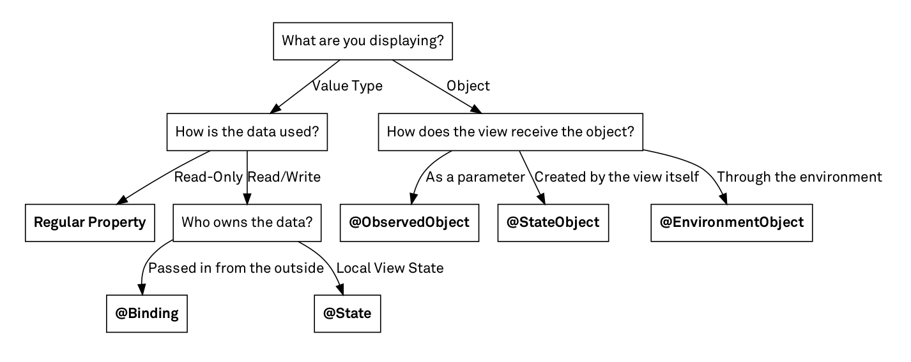

# Swift UI
#### 참조
 - [공식문서 - SwiftUI](https://developer.apple.com/documentation/swiftui)
 - [공식문서 - State](https://developer.apple.com/documentation/swiftui/state)
 - [공식문서 - Binding](https://developer.apple.com/documentation/swiftui/binding)
 - [공식문서 - Swift5 Release Notes](https://developer.apple.com/documentation/xcode-release-notes/swift-5-release-notes-for-xcode-10_2)
 - [공식Github - Swift5.1 기능](https://github.com/apple/swift-evolution/blob/master/proposals/0258-property-wrappers.md)


### 1. 프로젝트 구조
##### SwiftUiStudy 라는 이름으로 프로젝트 생성한 후 프로젝트 구조

- **SwiftUiStudyApp.swift**
    - @main : 이 앱의 EntryPoint(진입점)
    - App   : App protocol을 준수
    - body  : 첫페이지
    ```swift
    import SwiftUI

    @main
    struct SwiftUiStudyApp: App {
        var body: some Scene {
            WindowGroup {
                ContentView()
            }
        }
    }
    ```
- **ContentView.swift**
    - SwiftUI로 화면을 개발하는 파일
    - Storyboard로 개발하면 storyboard, ViewController파일이 필수로 필요했지만 SwiftUI는 View 파일에서 **선언형**으로 개발
    - **ContentView_Previews** : Xcode에서 뷰 미리보기를 제공하는 타입 프로토콜 상속받은 구조체 (Xcode11 버전부터 Xcode에서 Canvas 기능을 통해 미리보기)
        - Interface vs Protocol
            - 기능 구현 : Interface 필수 Protocol 선택적가능(optional)
            - 기본값 설정 : Interface O Protocol X
    ```swift
    import SwiftUI

    struct ContentView: View {
        var body: some View {
            Text("Hello, world!")
                .padding()
        }
    }

    struct ContentView_Previews: PreviewProvider {
        static var previews: some View {
            ContentView()
        }
    }
    ```
- **Assets**
- **Preview Content**
    - 미리보기에 사용될 Assets

- 앱 타겟을 멀티 플랫폼으로 할 시 **SceneDelegate.swift**파일이 생성되는데 iPadOS의 멀티 윈도와 같은 기능을 지원하기 위한 Delegate.


### 2. UI 기초
- #### Text

    ```swift
    // 기본적용
    Text("Hello World")

    // 인라인 확장함수(@inlinable, extension)를 이용해 커스텀
    Text("Hello World!Hello World!Hello World!Hello World!Hello World!")
        .lineLimit(1) // 1줄제한. 제한없으려면 .lineLimit(nil)
        .truncationMode(.middle) // 중간생략
        .font(.largeTitle) // 폰트
        .foregroundColor(Color.red) // 색상
    ```


- #### TextField

    - 값을 변경할때 뷰를 갱신해야한다면 변수 앞에 **@State** 달아줘야함(뒤에서 자세히 다룸)

        ```swift
        import SwiftUI

        struct ContentView: View {
            
            @State var searchString = "";
            
            var body: some View {
                // 뷰빌더(@ViewBuilder)를 통해 뷰를 빌드!
                Form{
                    TextField("Search",text: $searchString)
                }
            }
        }
        ```
    - **Preview**
    


- #### Image

    - ##### AsyncImage

        ```swift
        import SwiftUI

        struct ContentView: View {
            
            var body: some View {
                let url = URL(string: "https://img2.sbs.co.kr/img/sbs_cms/WE/2019/08/09/WE97496996_ori.jpg")!
                AsyncImage(url: url,scale: 3) // Scale Factor
            }
        }
        ```

     - 로딩중일때 보여줄 화면(placeholder)설정 가능함

        ```swift
        import SwiftUI

        struct ContentView: View {
            
            var body: some View {
                let url = URL(string: "https://img2.sbs.co.kr/img/sbs_cms/WE/2019/08/09/WE97496996_ori.jpg")!
                AsyncImage(url: url,scale: 3) { image in
                    image
                } placeholder: {
                    LoadingView()
                }
            }
        }

        struct LoadingView: View {
            var body: some View {
                Text("Loading")
            }
        }
        ```


- #### VStack, HStack, ZStack
    - VStack : 세로로 쌓이는 스택(Column in Flutter)
    - HStack : 가로로 쌓이는 스택(Row in Flutter)
    - ZStack : 겹치는 스택(Stack in Flutter)
    - **각각 스택안에는 10개의 뷰만 넣을 수 있으며 그 이상으로 넣으려면 Group으로 감싸야함. 이유는 뒤에서 설명!**
        ```swift
        import SwiftUI

        struct ContentView: View {
            
            var body: some View {
                ZStack{
                    HStack{
                        Text("Htest1")
                        Text("Htest1")
                        Text("Htest1")
                    }
                    VStack{
                        Text("Vtest1")
                        Text("Vtest1")
                        Text("Vtest1")
                    }
                }
            }
        }
        ```
    - **Preview**
    

- #### List
    - **스택과 마친가지로 10개의 뷰만 넣을 수 있으며 그 이상으로 넣으려면 Group으로 감싸야함.**
        ```swift
        import SwiftUI

        struct ContentView: View {
            
            var body: some View {
                List{
                    Text("1")
                    Text("2")
                    Text("3")
                    Text("4")
                    Text("5")
                }
            }
        }
        ```
    - **ForEach**로 리스트 빌드가능!
    - **10개이상 가능**
        ```swift
        import SwiftUI

        struct ContentView: View {
            
            @State var items = [1,2,3,4,5,6,7,8,9,10,11,12]
            
            var body: some View {
                List{
                    ForEach(0..<items.count){ index in
                        Text(String(items[index]))
                    }
                }
            }
        }
        ```

## UI선언 방식
- ### Extension 클로저 이용
    - #### 각각의 뷰 혹은 부모구조체의 뷰들이 가지고 있는 인라인 확장함수(@inlinable)를 통해서 프로퍼티 값 변경!
        - @inlinable : 함수를 호출할 때 복귀주소를 스택에 쌓고 해당 함수로 점프하는 방식이 아닌 컴파일 시 함수를 호출한 함수 스택 내에 삽입. -> CPU 연산 감소

- ### @ViewBuilder - 클로저를 매개변수로
    - 함수 빌더를 이용해 만들어진 내장 swift DSL
    - 뷰 생성시 전달받은 함수를 통해 하나 이상의 자식 뷰를 만드는데 사용
    - buildBlock 이라는 타입 메서드에 값을 전달하고, 전달받은 뷰가 2개 이상일때는 TupleView 라는 타입을 반환
    - **buildBlock 의 매개변수 최대 개수는 10개 이므로, ViewBuilder 에 전달할 수 있는 뷰의 개수도 10개**
        ```swift
        // SwiftUI 내부 코드
        // 갯수별로 extension 만들어져 있음
        // 맥시멈 10개까지 구현되어 있음

        ...

        @available(iOS 13.0, macOS 10.15, tvOS 13.0, watchOS 6.0, *)
        extension ViewBuilder {

            public static func buildBlock<C0, C1, C2, C3, C4, C5, C6, C7>(_ c0: C0, _ c1: C1, _ c2: C2, _ c3: C3, _ c4: C4, _ c5: C5, _ c6: C6, _ c7: C7) -> TupleView<(C0, C1, C2, C3, C4, C5, C6, C7)> where C0 : View, C1 : View, C2 : View, C3 : View, C4 : View, C5 : View, C6 : View, C7 : View
        }

        @available(iOS 13.0, macOS 10.15, tvOS 13.0, watchOS 6.0, *)
        extension ViewBuilder {

            public static func buildBlock<C0, C1, C2, C3, C4, C5, C6, C7, C8>(_ c0: C0, _ c1: C1, _ c2: C2, _ c3: C3, _ c4: C4, _ c5: C5, _ c6: C6, _ c7: C7, _ c8: C8) -> TupleView<(C0, C1, C2, C3, C4, C5, C6, C7, C8)> where C0 : View, C1 : View, C2 : View, C3 : View, C4 : View, C5 : View, C6 : View, C7 : View, C8 : View
        }

        @available(iOS 13.0, macOS 10.15, tvOS 13.0, watchOS 6.0, *)
        extension ViewBuilder {

            public static func buildBlock<C0, C1, C2, C3, C4, C5, C6, C7, C8, C9>(_ c0: C0, _ c1: C1, _ c2: C2, _ c3: C3, _ c4: C4, _ c5: C5, _ c6: C6, _ c7: C7, _ c8: C8, _ c9: C9) -> TupleView<(C0, C1, C2, C3, C4, C5, C6, C7, C8, C9)> where C0 : View, C1 : View, C2 : View, C3 : View, C4 : View, C5 : View, C6 : View, C7 : View, C8 : View, C9 : View
        }
        }
        ```
        https://developer.apple.com/documentation/swiftui/viewbuilder

    - #### 애플은 왜 이렇게 불편하게 만들었을까?
        - Swift는 현재 가변 제네릭을 지원하지 않음
         https://github.com/apple/swift/blob/main/docs/GenericsManifesto.md#variadic-generics


### 3. Swift 5.1 Property Wrappers

#### 3.1 Property Wrapper
[스위프트 문서](https://docs.swift.org/swift-book/LanguageGuide/Properties.html#ID617)

- 프로퍼티가 ***저장*** 되는 방식을 관리하는 코드와 프로퍼티를 ***정의*** 하는 코드 ***분리***
    - 원문 : A property wrapper adds a layer of separation between code that manages how a property is stored and the code that defines a property.
- ***여러 프로퍼티들에 동일한 관리 코드가 필요하다면 사용!***
    - 원문 : When you use a property wrapper, you write the management code once when you define the wrapper, and then reuse that management code by applying it to multiple properties.
- Swift 5.1 에 추가
- 지역 변수(local stored variable)에서만 사용 가능

- 공식페이지 예제
```swift
// 프로퍼티래퍼 정의
@propertyWrapper
struct TwelveOrLess {
    private var number = 0
    var wrappedValue: Int {
        get { return number }
        set { number = min(newValue, 12) }
    }
}


struct SmallRectangle {
    @TwelveOrLess var height: Int // 정의된 프로퍼티래퍼 사용
    @TwelveOrLess var width: Int // 정의된 프로퍼티래퍼 사용
}

var rectangle = SmallRectangle()
print(rectangle.height)
// Prints "0"

rectangle.height = 10
print(rectangle.height)
// Prints "10"

rectangle.height = 24
print(rectangle.height)
// Prints "12"
```

#### 3.2. State

[공식문서 - State](https://developer.apple.com/documentation/swiftui/state)

- SwiftUI는 **State**로 선언한 속성의 저장소를 관리. **값이 변경**되면 SwiftUI는 값에 의존하는 **뷰 계층 구조의 부분을 업데이트**함
    - SwiftUI manages the storage of a property that you declare as state. When the value changes, SwiftUI updates the parts of the view hierarchy that depend on the value

        ```swift
        import SwiftUI

        struct ContentView: View {
            
            @State private var isPlaying: Bool = false
            
            var body: some View {
                Button(isPlaying ? "Pause" : "Play") {
                    isPlaying.toggle()
                }
            }
        }
        ```

#### 3.3. Binding

[공식문서 - Binding](https://developer.apple.com/documentation/swiftui/binding)

-  상위뷰의 State 값을 참조할때 사용

    ```swift
    import SwiftUI

    struct ContentView: View {
        @State private var isPlaying: Bool = false
        
        var body: some View {
            // 변수명 앞에 & 앰퍼샌드 붙이고 전달!
            PlayButton(isPlaying: $isPlaying)
        }
    }

    struct PlayButton: View {
        // 값 받는곳에 @Binding
        @Binding var isPlaying: Bool

        var body: some View {
            Button(isPlaying ? "Pause" : "Play") {
                isPlaying.toggle()
            }
        }
    }
    ```

#### 3.4. StateObject
[공식문서 - StateObject](https://developer.apple.com/documentation/swiftui/stateobject)

- ObservableObject를 인스턴스화 하는 프로퍼티 wrapper 타입
```swift
    import SwiftUI

    struct ContentView: View {
        @StateObject var countRepo = CountRepo()
        
        var body: some View {
            Button("\(self.countRepo.count)") {
                self.countRepo.count += 1
            }
        }
    }

    class CountRepo: ObservableObject {
        // @Published : 값이 변할때마다 ObservableObject가 가지고있는
        // objectWillChange.send() 를 호출해 UI에 알림
        @Published var count: Int = 0
    }
```

#### 3.5. ObservableObject

- View에서 외부 Object 참조할때
- @ObservedObject var countRepo = CountRepo() 이렇게 사용도 가능하지만 이렇게 하면 상위 뷰의 값이 변경되면 해당 뷰는 다시 그려져서 해당 인스턴스는 새로 생성됨

    ```swift
    struct ContentView: View {
        @StateObject var countRepo = CountRepo()
        
        var body: some View {
            PlayButton(countRepo: countRepo)
        }
    }

    struct PlayButton: View {
        // 값 받는곳에 @Binding
        @ObservedObject var countRepo: CountRepo

        var body: some View {
            Button("\(self.countRepo.count)") {
                self.countRepo.count += 1
            }
        }
    }

    class CountRepo: ObservableObject {
        // @Published : 값이 변할때마다 ObservableObject가 가지고있는
        // objectWillChange.send() 를 호출해 UI에 알림
        @Published var count: Int = 0
    }
    ```

#### 3.6. EnvironmentObject

- 별도로 값을 전달해주지 않아도 상속받는 부모로부터 함께 적용되는 오브젝트

    - main
        ```swift
        import SwiftUI

        @main
        struct SwiftUiStudyApp: App {
            var body: some Scene {
                WindowGroup {
                    // ContentView에 environmentObject등록
                    ContentView().environmentObject(CountRepo())
                }
            }
        }
        ```
    - ContentView
        ```swift
        import SwiftUI

        struct ContentView: View {
            
            var body: some View {
                VStack {
                    ChildTextView()
                    ChildButtonView()
                }
            }
        }

        class CountRepo: ObservableObject {
            @Published var count: Int = 0
        }


        struct ChildTextView:View{
            @EnvironmentObject var countRepo:CountRepo
            var body: some View{
                Text("\(self.countRepo.count)").font(.largeTitle)
            }

        }

        struct ChildButtonView:View{
            @EnvironmentObject var countRepo:CountRepo
            var body: some View{
                Button("숫자증가") {
                    self.countRepo.count += 1
                }
            }

        }
        ```

