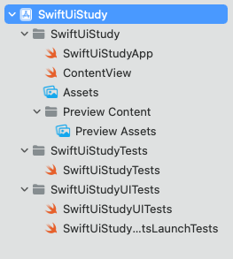
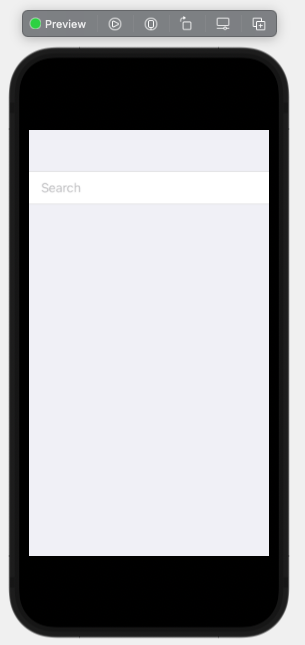
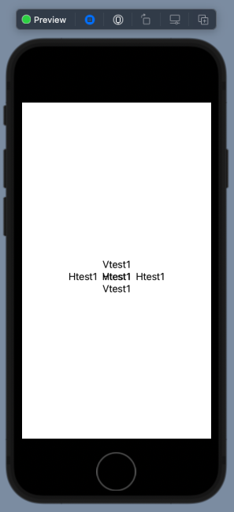

수정자


{}
뷰 빌더는 함수 빌더를 이용해 만들어진 내장 swift DSL이다. 뷰 생성시 전달받은 함수를 통해 하나 이상의 자식 뷰를 만드는데 사용된다.
뷰 빌더는 buildBlock 이라는 타입 메서드에 값을 전달하고, 전달받은 뷰가 2개 이상일때는 TupleView 라는 타입을 반환한다.
buildBlock 의 매개변수 최대 개수는 10개 이므로, ViewBuilder 에 전달할 수 있는 뷰의 개수도 10개이다.
따라서 VStack {}, List {} 내부에 10개를 넘는 뷰를 넣을경우 컴파일 에러가 발생한다.

10개 이유

https://stackoverflow.com/questions/64927159/why-swiftui-limited-viewbuilder-parameters-count-to-10

@escaping
클로저가 함수의 인자로 전달됐을 때, 함수의 실행이 종료된 후 실행되는 클로저

# Swift UI
#### 참조
 - [공식문서 - SwiftUI](https://developer.apple.com/documentation/swiftui)
 - [공식문서 - State](https://developer.apple.com/documentation/swiftui/state)
 - [공식문서 - Binding](https://developer.apple.com/documentation/swiftui/binding)
 - [공식문서 - Swift5 Release Notes](https://developer.apple.com/documentation/xcode-release-notes/swift-5-release-notes-for-xcode-10_2)
 - [공식Github - Swift5.1 기능](https://github.com/apple/swift-evolution/blob/master/proposals/0258-property-wrappers.md)


### 1. 프로젝트 구조
##### SwiftUiStudy 라는 이름으로 프로젝트 생성한 후 프로젝트 구조

- **SwiftUiStudyApp.swift**
    - @main : 이 앱의 EntryPoint(진입점)
    - App   : App protocol을 준수
    - body  : 첫페이지
```swift
import SwiftUI

@main
struct SwiftUiStudyApp: App {
    var body: some Scene {
        WindowGroup {
            ContentView()
        }
    }
}
```
- **ContentView.swift**
    - SwiftUI로 화면을 개발하는 파일
    - Storyboard로 개발하면 storyboard, ViewController파일이 필수로 필요했지만 SwiftUI는 View 파일에서 **선언형**으로 개발
    - **ContentView_Previews** : Xcode에서 뷰 미리보기를 제공하는 타입 프로토콜 상속받은 구조체 (Xcode11 버전부터 Xcode에서 Canvas 기능을 통해 미리보기)
        - Interface vs Protocol
            - 기능 구현 : Interface 필수 Protocol 선택적가능(optional)
            - 기본값 설정 : Interface O Protocol X
```swift
import SwiftUI

struct ContentView: View {
    var body: some View {
        Text("Hello, world!")
            .padding()
    }
}

struct ContentView_Previews: PreviewProvider {
    static var previews: some View {
        ContentView()
    }
}
```
- **Assets**
- **Preview Content**
    - 미리보기에 사용될 Assets

- 앱 타겟을 멀티 플랫폼으로 할 시 **SceneDelegate.swift**파일이 생성되는데 iPadOS의 멀티 윈도와 같은 기능을 지원하기 위한 Delegate.


### 2. UI 기초
#### Text
- 기본선언
```swift
Text("Hello World")
```
- 줄길이 제한
```swift
// 3줄제한
Text("Hello World")
    .lineLimit(3)

// 제한없음
Text("Hello World")
    .lineLimit(nil)
```
- 생략
```swift
// 중간생략
Text("Hello World!Hello World!Hello World!Hello World!Hello World!")
    .truncationMode(.middle)
```
- 폰트
```swift
Text("Hello World")
    .font(.largeTitle)
```
- 색상
```swift
    .foregroundColor(Color.red)
```
#### TextField
    - 값을 변경할때 뷰를 갱신해야한다면 변수 앞에 **@State** 달아줘야함(뒤에서 자세히 다룸)
```swift
import SwiftUI

struct ContentView: View {
    
    @State var searchString = "";
    
    var body: some View {
        Form{
            TextField("Search",text: $searchString)
        }
    }
}
```
**Preview**



#### Image
##### AsyncImage
```swift
import SwiftUI

struct ContentView: View {
    
    var body: some View {
        let url = URL(string: "https://img2.sbs.co.kr/img/sbs_cms/WE/2019/08/09/WE97496996_ori.jpg")!
        AsyncImage(url: url,scale: 3) // Scale Factor
    }
}
```
- 로딩중일때 보여줄 화면(placeholder)설정 가능함
```swift
import SwiftUI

struct ContentView: View {
    
    var body: some View {
        let url = URL(string: "https://img2.sbs.co.kr/img/sbs_cms/WE/2019/08/09/WE97496996_ori.jpg")!
        AsyncImage(url: url,scale: 3) { image in
            image
        } placeholder: {
            LoadingView()
        }
    }
}

struct LoadingView: View {
    var body: some View {
        Text("Loading")
    }
}
```
#### VStack, HStack, ZStack
- VStack : 세로로 쌓이는 스택(Column in Flutter)
- HStack : 가로로 쌓이는 스택(Row in Flutter)
- ZStack : 겹치는 스택(Stack in Flutter)
```swift
import SwiftUI

struct ContentView: View {
    
    var body: some View {
        ZStack{
            HStack{
                Text("Htest1")
                Text("Htest1")
                Text("Htest1")
            }
            VStack{
                Text("Vtest1")
                Text("Vtest1")
                Text("Vtest1")
            }
        }
    }
}
```
**Preview**


#### List
#### NavigationView


### 3. Swift 5.1 주요기능
#### 3.1 Property Wrappers
#### 3.2. State
#### 3.3. Binding
#### 3.4. ObservableObject
#### 3.5. EnvironmentObject

### 4. 통신
#### 4.1 요청
#### 4.2 직렬화, 역직렬화


### [Xcode] Package Manger vs [iOS - Swift] cocoaPods
